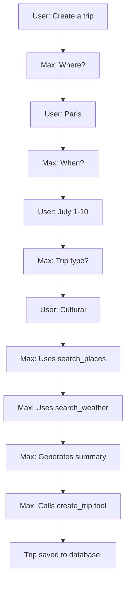

# Travel Planner AI Backend

AI-powered travel planning assistant backend using FastAPI, LangGraph, and OpenAI.

## Architecture

```
python_backend/
├── setup.py              # FastAPI application & API endpoints
├── agent.py              # LangGraph AI agent configuration
├── models.py             # Pydantic models for type safety
├── trip_tools.py         # LangChain tools for trip operations
├── search_weather.py     # Weather search functionality
├── ToolLogger.py         # Tool execution logging
├── services/
│   ├── __init__.py
│   └── trip_service.py   # Business logic for trips
└── requirements.txt      # Python dependencies
```

## Tech Stack

- **FastAPI** - Modern Python web framework
- **LangGraph** - Agentic workflow orchestration
- **LangChain** - LLM tool integration
- **OpenAI GPT-4o-mini** - Language model
- **SerpAPI** - Real-time search & weather data
- **Pydantic** - Data validation & type safety

## Features

### AI Agent (Max)

- ✅ Conversational trip creation with smart Q&A flow (no repeated questions!)
- ✅ Weather checking for any location (flexible input formats)
- ✅ Place & attraction search
- ✅ AI-generated trip summaries
- ✅ Context-aware responses with user's trip history
- ✅ Automatic tool usage - no manual clicking required
- ✅ Flexible date & location parsing

### Tools Available to Agent

1. **create_trip** - Create trips with locations and AI summaries
2. **search_weather** - Get weather for any location
3. **search_places** - Find attractions, restaurants, etc.
4. **search_trip_planning** - Get trip planning information

## Setup

### 1. Install Dependencies

```bash
pip install -r requirements.txt
```

### 2. Environment Variables

Create `.env` file in project root:

```env
# OpenAI
OPENAI_API_KEY=your_openai_key

# SerpAPI (for search & weather)
SERPAPI_API_KEY=your_serpapi_key

# Next.js API (optional, defaults to localhost:3000)
NEXTJS_API_BASE=http://localhost:3000
```

### 3. Run the Server

```bash
# Development
uvicorn setup:app --reload --port 8000

# Production
uvicorn setup:app --host 0.0.0.0 --port 8000
```

Server runs on: `http://localhost:8000`

## API Endpoints

### POST `/chat-trip`

Stream chat responses from the AI assistant.

**Request:**

```json
{
  "user_input": "I want to create a trip to Paris",
  "user_id": "user_123"
}
```

**Response:** Server-Sent Events (SSE) stream

```
data: {"ai_response": "Where"}
data: {"ai_response": " would"}
data: {"ai_response": " you"}
...
```

### GET `/health`

Health check endpoint.

**Response:**

```json
{
  "status": "healthy",
  "service": "Travel Planner AI API"
}
```

## AI Agent Flow

### Creating a Trip



## Models (Pydantic)

### ChatRequest

```python
{
    "user_input": str,
    "user_id": str
}
```

### LocationData

```python
{
    "name": str,
    "lat": float,
    "lng": float
}
```

### TripCreate

```python
{
    "user_id": str,
    "title": str,
    "description": str,
    "summary": Optional[str],
    "start_date": str,  # YYYY-MM-DD
    "end_date": str,    # YYYY-MM-DD
    "locations": List[LocationData]
}
```

## Services Layer

### TripService

Handles trip data operations with Next.js API.

```python
from services import TripService

# Fetch user trips
trips_context = TripService.fetch_user_trips(user_id)
```

## Development

### Adding a New Tool

1. Define tool in `trip_tools.py` or new file:

```python
from langchain_core.tools import tool

@tool
def my_new_tool(param: str) -> str:
    """Tool description for the AI"""
    # Implementation
    return result
```

2. Add to tools list in `agent.py`:

```python
tools = [
    search_places,
    search_weather,
    my_new_tool,  # Add here
]
```

3. Update system prompt to mention the new tool

### Testing Tools

Check `tool_results.json` for logged tool executions.

## Troubleshooting

### Agent not using tools

- Check system prompt mentions the tool
- Verify tool docstring is clear
- Check LLM temperature (higher = more creative)

### Connection errors

- Verify Next.js is running on port 3000
- Check `NEXTJS_API_BASE` environment variable
- Ensure PostgreSQL database is accessible

### Streaming issues

- Check FastAPI is returning `StreamingResponse`
- Verify `TextStreamChatTransport` in frontend
- Look for errors in Python console

## Performance

- **Token streaming**: ~50-100ms per token
- **Tool execution**: 1-3s depending on external APIs
- **Context window**: Up to 128k tokens (GPT-4o-mini)

## Security Notes

- Never commit API keys to git
- Use `.env` for all secrets
- Validate user input with Pydantic
- Sanitize database queries (handled by Prisma in Next.js)

## Future Enhancements

- [ ] Add conversation memory with vector DB
- [ ] Multi-language support
- [ ] Image generation for trips
- [ ] Price estimation tools
- [ ] Booking integration
- [ ] Voice interface

## License

Private project
